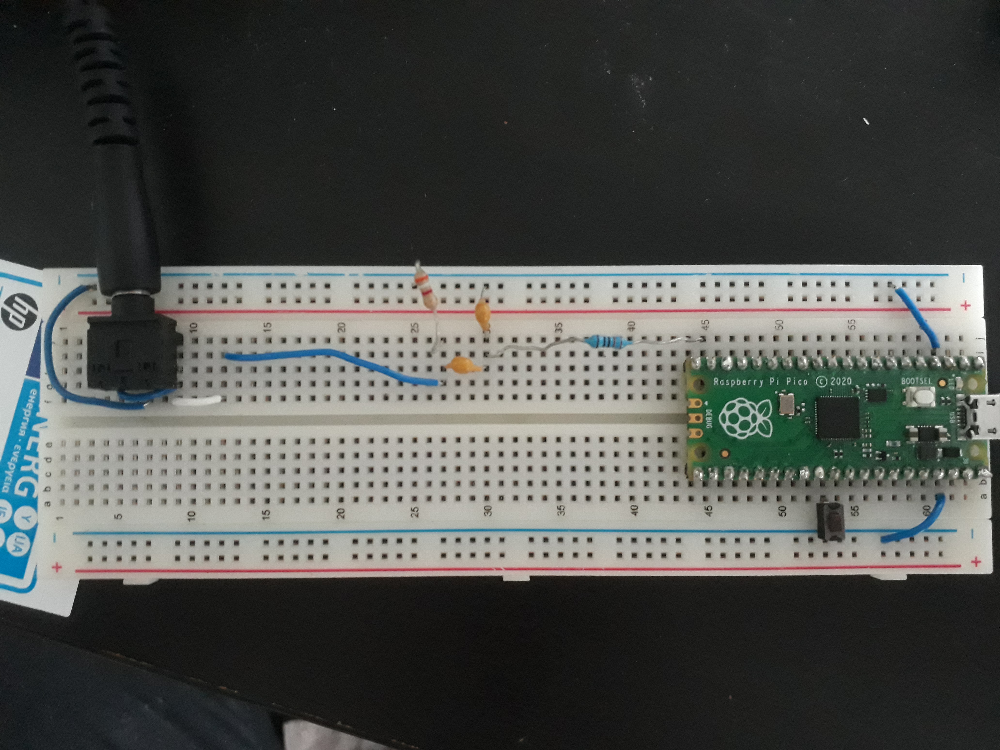

# Pico-USB-audio
This library streams Audio over USB to Raspberry Pi Pico microcontrollers. It then uses a 4th order pulse density modulator to output audio through the Pico's Programmable Input Outputs (PIO). It only requires two resistors and two capacitors to output pretty good audio. Check out the video below. 


<p align="center">

[](https://www.youtube.com/watch?v=kuy6rja3Azc) 

</p>

## Table of contents
0. [Preface](#pref)
1. [Arduino Code](#a)
2. [The Circuit](#b)
3. [Tones](#c)
4. [USB Microphones](#d)
5. [Other microcontrollers](#f)
6. [Building for pico-sdk](#f)

<a name="pref"></a>
## Preface
There are a couple of things to be aware of when using this library. 
1. It overclocks (230.4 Mhz for 64 times oversampling) and underclocks (115.2 MHz for 32 X oversampling) the Pico.
2. Sigma delta modulaters can get unstable and produce unpleasant sounds. 
3. I won't guarantee this code won't blow up your favourite speakers or headphones (it shouldn't) but no guarantees.

<a name="a"></a>
## Arduino Mbed Code
An Arduino compatible USB sound card version is available. This code uses the official Arduino RP2040 core. This greatly simplifes the install and development process. The necessary mbed files can be easily installed with the Arduino board manager. Search "mbed rp2040" and install. Install the [Arduino library](SDM) in your Arduino libraries folder. Then run the [mbedUSB example](https://github.com/tierneytim/Pico-USB-audio/tree/main/SDM/examples/mbedUSB)  for 32 times oversampling and the [mbedUSB64 example](https://github.com/tierneytim/Pico-USB-audio/tree/main/SDM/examples/mbedUSB64)
for 64 times oversampling.

```cpp
#include "pdmAudio.h"

// PDM object
pdmAudio pdm;

void setup() {
  // set pin 14 to be the output
  pdm.begin(14);
  
  // intiate USB transfer
  pdm.USB();
}

void loop() {
   // write whatever is in the USB buffer to the PDM -DAC
   pdm.USBwrite();
}


```
<a name="b"></a>
## The Circuit
The Circuit is pretty simple, it is composed of A lowpass filter at bout 20 KHz and a decoupling capactitor to removed the DC offset. The Output voltage is 1.6V peak-peak. This can be made approximately 1.1V peak to peak in software if that is preferable. 

<p align="center">
 
</p>

and in reality it looks like this.

<p align="center">
 
</p>

<a name="c"></a>
# Tones
Tones can be played in a manner similar to the Tone library for arduino.

```cpp
##include "pdmAudio.h"

// PDM object
pdmAudio pdm;

void setup() {
  pdm.begin(14);
}

void loop() {
  //each tone is governed by a frequency and duration(seconds)
  // zero frequency keeps voltage constant
  pdm.tone(262, .25);
  pdm.tone(0, .165);

  pdm.tone(196, 0.125);
  pdm.tone(0, .08);

  pdm.tone(196, 0.125);
  pdm.tone(0, .08);

  pdm.tone(220, 0.25);
  pdm.tone(0, .16);

  pdm.tone(196, 0.25);
  pdm.tone(0, .16);
  
  pdm.tone(0, 0.25);
  pdm.tone(0, .16);
  
  pdm.tone(247, 0.25);
  pdm.tone(0, .16);

  pdm.tone(262, 0.25);
  pdm.tone(0, 1);

}
```

<a name="d"></a>
# USB microphones
Microphone data  can be passed to the computer over USB using the following code. This test sends a 48O Hz sine wave over USB that can be monitored with a software such as Audacity.  

```cpp
#include "pdmAudio.h"

pdmAudio pdm;

void setup() {
  pdm.USB();
}

void loop() {
  // look up table sine-wave at 480 Hz
  int16_t left = pdm.sine_lu(480);
  int16_t right = left;
  // write  stereo data to computer
  pdm.USBtransfer(left, right);
}

```
<a name="e"></a>
# Other microcontrollers
To support microcontrollers other than the RP2040 a few things are needed. 
1. Fast multiplication and addition of 32-bit integers. 
2. A peripheral that can create precisely timed, high frequency pulses (PIO on rp2040 or I2S on other controllers).
3. A mechanism of audio acquisition (USB, Bluetooth, SD card).

Currently the following features are supported for different controllers  

MCU  | PDM | Tones | USB | Bluetooth| CPU - 32x(%) | CPU - 64x(%)
------------- | ------------- | ------------- | -------------| ------------- | ------------- | -------------
RP2040  | :heavy_check_mark:  | :heavy_check_mark:  | :heavy_check_mark: | :x: | 33% | 66% - 230.4 MHz
ESP32   | :heavy_check_mark: | :heavy_check_mark:  | :x:  | :heavy_check_mark: | 30% | 60% - 240 MHz
ESP32-S2   | :heavy_check_mark: | :heavy_check_mark:  | :x:  | :x: | 30% | 60% - 240 MHz
STM32  | :heavy_check_mark:  | :x:  | :x: | :x: | 30% | 60% - 168 MHz
Feather M4   | :x: | :x: | :x:  | :x: | NA | NA 
Teensy 4.1   | :heavy_check_mark:| :x:  | :x:  | :x: | 5% | 10% - 600 MHz


 

<a name="f"></a>
# Building for pico-sdk
Cmake and pico USB became too hard to maintain. Arduino code is now all that is supported. 
